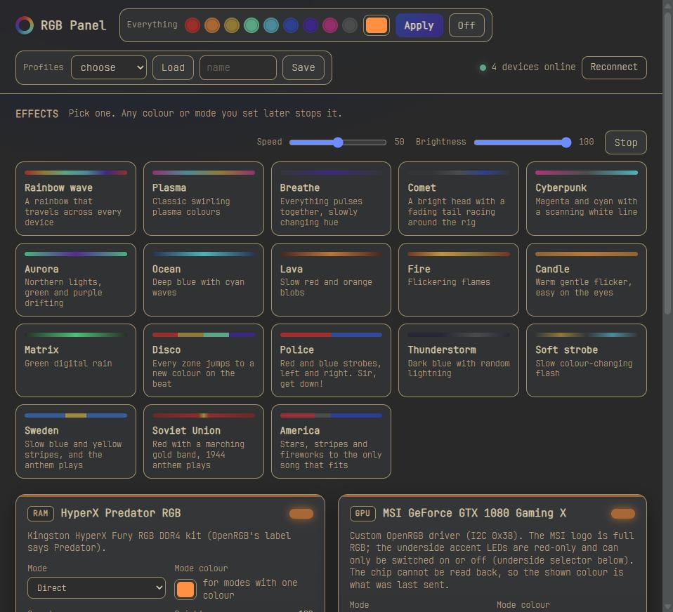

<h1 align="center">RGB Panel</h1>

<p align="center">
  One panel for every light in the PC: motherboard, RAM, GPU, mousepad.<br>
  Built on the <a href="https://openrgb.org">OpenRGB</a> SDK. Web page, native Windows app, and a CLI.
</p>

<p align="center">
  
</p>

## What it does

- **One surface for all devices.** Every device OpenRGB detects shows up as a card with its hardware
  modes, a colour per zone, speed and brightness. Modes apply the moment you pick them, sliders are
  live while you drag.
- **Brightness that works everywhere.** Most RGB hardware has no brightness control. The panel adds
  a software one per device: it remembers the colours you asked for and sends them dimmed, and on
  animated hardware modes it dims the mode's own colour so the device never drops out of its
  animation.
- **22 software effects** rendered by the panel and streamed per LED across all devices at once, so a
  wave travels from the RAM across the board to the GPU logo and the mousepad. Rainbow wave, Plasma,
  Breathe, Comet, Cyberpunk, Aurora, Ocean, Lava, Fire, Candle, Matrix, Disco, Police, Thunderstorm,
  Soft strobe, plus seven that come with sound.
- **Music presets.** Sweden, Soviet Union, America, India, Syria, Israel, France and Police play a recording and make the lights
  react to its loudness envelope. Recordings are fetched by `fetch_music.py`; a small stdlib
  synthesizer plays the Swedish anthem when no recording is present.
- **Profiles and persistence.** OpenRGB profiles from the panel, a startup profile so everything
  comes back after a reboot, and the running effect resumed at logon.
- **Self-healing.** A watchdog restarts the OpenRGB server task when its SDK port goes quiet.
- **A driver for the MSI GTX 1080 Gaming X**, a card stock OpenRGB does not support, as a patch
  against OpenRGB with a build recipe.

## Pieces

| File | Role |
|---|---|
| `panel.py` + `panel.html` | backend (stdlib HTTP server over the SDK) and the page it serves |
| `effects.py` | the effect engine and presets |
| `anthem.py` | "Du gamla, du fria" synthesized from a public-domain ABC transcription |
| `rgb.py` | CLI: `rgb list`, `rgb set gpu ff4000`, `rgb mode ram Breathing --speed 40`, `rgb profile save night` |
| `app.py` + `app.spec` | desktop app (pywebview on WebView2, packaged with PyInstaller) |
| `fetch_music.py` | yt-dlp downloads for the music presets, pinned uploads, intro trims |
| `identify.py` | lights every zone a different colour to map which wire goes where |
| `build/` | OpenRGB patch and build scripts for the GPU driver |

## Setup (Windows)

```
winget install namazso.PawnIO        # signed kernel driver OpenRGB uses for SMBus (RGB RAM)
winget install OpenRGB.OpenRGB
uv sync
```

Run OpenRGB elevated as an SDK server (`OpenRGB.exe --server --startminimized --profile default`
from a logon task with highest privileges is what this project uses; elevation is needed for the
RAM). Then:

```
uv run python panel.py --host 0.0.0.0 --port 6780     # web panel
uv run python app.py                                   # desktop window
uv run python rgb.py list                              # CLI
uv run pyinstaller app.spec                            # dist\RGB Panel\RGB Panel.exe
```

Copy `labels.example.json` to `labels.json` to give zones friendly names and notes. If the panel runs
from a logon task, launch it with a windowless interpreter (`pythonw.exe`), and note that in a uv
venv `.venv\Scripts\pythonw.exe` is a launcher that spawns a console `python.exe`; use the base
interpreter named in `.venv\pyvenv.cfg` instead. `panel.py` finds the venv's packages by itself.

## Hardware this was built on

| Device | Bus | Notes |
|---|---|---|
| ASUS ROG STRIX X570-F Gaming | Aura USB | onboard LEDs, 2x 12V and 2x addressable headers; set the LED count of addressable headers once |
| Kingston HyperX Fury RGB DDR4 | SMBus via PawnIO | OpenRGB labels it "HyperX Predator RGB" |
| ASUS ROG Balteus Qi | USB HID | the only device here with hardware brightness |
| MSI GeForce GTX 1080 Gaming X 8G | NvAPI I2C | needs the custom build below |
| Cooler Master ML240L V2 ARGB | addressable header | controlled as part of the motherboard |

Anything else OpenRGB supports should just appear; the panel has no device-specific code apart from
the GPU underside switch described below.

## The GTX 1080 Gaming X driver

Stock OpenRGB sees the card's I2C bus but has no entry for it. Copying the GTX 1070 Gaming X entry
(address 0x68) does not work: a scan of the NvAPI bus found the LED controller at **0x38**,
write-only, with a status register at 0x31 that must read 0x00 before each packet or the packet is
dropped. Packets are one register write per byte: command (0x15 static, 0x18 off), LED mask,
zero, R G B scaled to 0..32, then 0xFA.

LED groups on this card, verified by eye: mask 0x01 is the RGB "MSI" logo, mask 0x04 the red-only
accent LEDs on the underside (they ignore colour and only react to on/off), mask 0x02 nothing
visible. The driver sends the Off command for a group set to black, which is how the underside is
switched. The panel shows an "underside" selector (auto/on/off): in auto it is lit only when the
card looks reddish, for a static colour by the logo colour, for an effect by sampling its first
seconds once at start so it never flickers, unless the effect pins the answer itself (India's saffron
would otherwise count as red).

Rebuild: `build\build.cmd` mirrors OpenRGB's `scripts\build-windows.bat` (Qt 5.15 msvc2019_64,
VS Build Tools, jom, windeployqt) and applies `build\gtx1080-gaming-x.patch` on OpenRGB
1.0rc3.1 (commit `5e81e26`). `build\stage-and-test.ps1` copies the result next to the stock
install's PawnIO modules. Details and the protocol table are in the patch.

## Music presets and yt-dlp

`fetch_music.py` downloads pinned uploads with yt-dlp, converts them to 44.1 kHz WAV, and trims the
intros so each preset starts on the right beat. The recordings are not in this repository and
fetching them is your own responsibility. YouTube bot-checks VPN and datacenter IPs; the script's
docstring explains the workarounds.

## Gotchas

- Vendor RGB software (Armoury Crate and friends) must be off; two apps on one controller confuse it.
- Resizing an addressable zone re-initialises the Aura controller and wipes colours set before it.
- OpenRGB must run elevated for the RAM; a non-elevated OpenRGB instance simply connects as a client.
- The GPU chip cannot be read back, so its shown colour is whatever was last sent, and it forgets its
  colour when OpenRGB stops; the startup profile restores it.

## License

MIT for this project. `build/gtx1080-gaming-x.patch` is a patch against OpenRGB and carries
OpenRGB's GPL-2.0-or-later.
